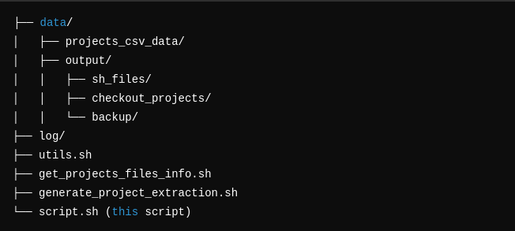

# d4j_checkout_projec
Automate defects4j project extraction


# Defects4J Checkout Script

This repository contains a Bash script to automate the process of checking out projects using the Defects4J framework. It facilitates preparing directories, processing project data, and running shell scripts to manage the project extraction and checkout process.

## Prerequisites

- **Defects4J**: Ensure Defects4J is installed and configured properly.
- **Bash**: The script is written for Unix-based systems and requires a Bash-compatible environment.
- **Utilities**: This script relies on additional helper scripts and utilities:
  - `utils.sh`: Contains helper functions (e.g., logging, directory validation).
  - `get_projects_files_info.sh`: Retrieves project data.
  - `generate_project_extraction.sh`: Generates project extraction commands.

## Directory Structure




## Variables and Constants

- **`d4j_csv_projects_file`**: Path to the Defects4J projects CSV file.
- **`app_file_path`**: Base directory for storing project data.
- **`project_csv_data`**: Directory where the CSV data for projects is stored.
- **`output_dir`**: Directory for storing output data.
- **`sh_cmd_file_path`**: Directory where generated shell command files are stored.
- **`checkout_projects_dir`**: Directory for storing checked out projects.
- **`logdir`**: Directory for log files.
- **`backup_checked_projects_dir`**: Directory for storing backup of checked-out projects.

## Usage

### Command Syntax

```bash
./script.sh <d4j_root_dir> <version> <project_name_or_#>

Ex: 
    ./d4j_checkout_proj.sh "/opt/Bug_Def_Purification/defects4j" "b" "JacksonXml"
    ./d4j_checkout_proj.sh "/opt/Bug_Def_Purification/defects4j" "f" "JacksonXml"
    ./d4j_checkout_proj.sh "/opt/Bug_Def_Purification/defects4j" "f" "#"
    ./d4j_checkout_proj.sh "/opt/Bug_Def_Purification/defects4j" "b" "#"

<d4j_root_dir>: The root directory where Defects4J is installed.
<version>: The version of the project to be checked out (f or b for fix or buggy).
<project_name_or_#>: The name of the project or # to run for all projects.

./script.sh /path/to/defects4j v1.0 project-name

This command will:

Validate the directories.
Prepare the necessary directories for storing data and outputs.
Fetch project data from Defects4J.
Generate shell command files for the specified project.
Run the generated commands to checkout the specified project.
Running for All Projects
To run the script for all projects in the dataset:

./script.sh /path/to/defects4j v1.0 "#"


Functions Overview
validate_inital_directory: Prepares the required directories for the script.
run_sh_files: Executes generated shell scripts for either a specific project or all projects.
print_init_process_message: Prints the starting message for the process.
print_end_process_message: Prints the completion message for the process.
main: The main function that coordinates the entire checkout process, including validating directories, fetching project data, and running the checkout commands.

Logging
Logs are stored in the log directory. The script uses logging functions for tracking the execution process, warnings, and errors.

Error Handling
The script will exit if required arguments are not provided or if the specified directories are invalid.
The script checks for the presence of helper scripts and the Defects4J root directory before proceeding.
License
This project is licensed under the MIT License. See the LICENSE file for details.


This `README.md` explains the script's purpose, its usage, prerequisites, and the key functions. Make sure to adjust paths and descriptions as needed based on your actual setup and file structure.
